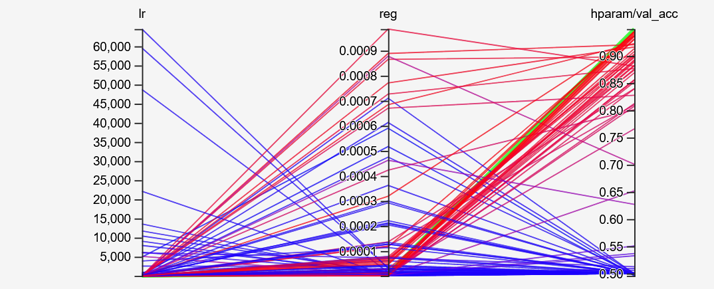
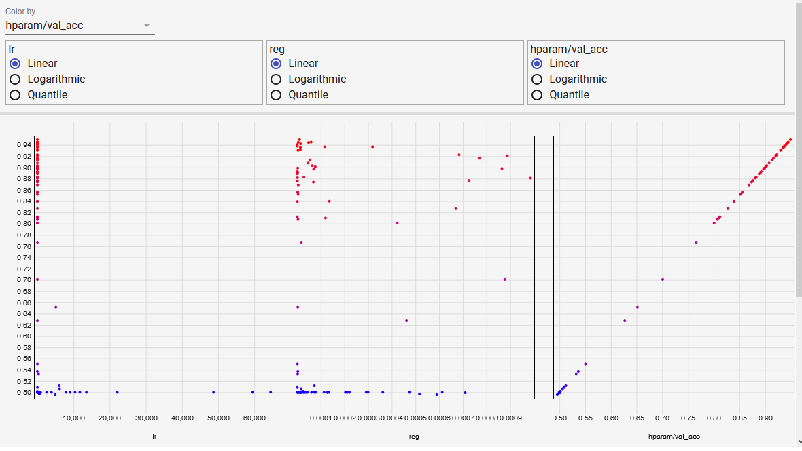
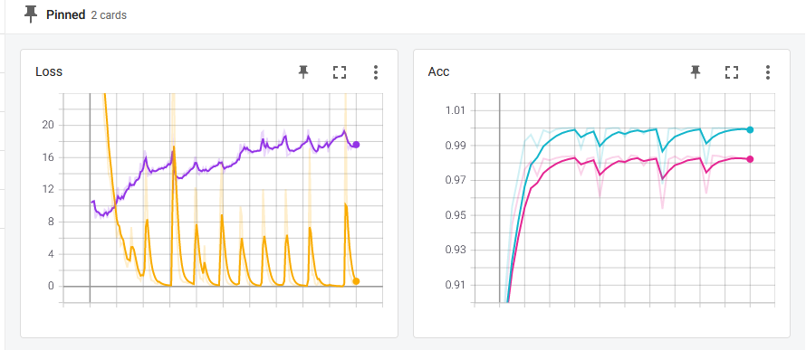

# Distinguishing Birds from Airplanes using the CIFAR10 dataset
- A simple classifier to distinguish birds from airplanes using the CIFAR10 dataset using mainly PyTorch
- Hyperparameter tuning has been done only for the learning rate and the regularisation factor (momentum will be done later)
- Optimizer: Atom with default parameters
- Testing was done using the CIFAR10 test_dataset, but only using accuracy as a metric. Recall, Precision and F1 score should also be done since this is a classifier
- Readings have been plotted using **TensorBoard**: 
    - [Babysitting](\runs\Babysitting): Referers to the sanity check made to ensure the model runs properly and can ovefit
    - [Lr_reg](runs\lr_reg): Reading collected when doing hyperparameter tuning for the learning rate and the regularisation factor
    
<table>
    <tr>
    <td>
    
    </td>
    <td>
    
    </td>
    </tr>
    </table>

    - [Training](runs\Training): Training routines initiated with the hyperparameters chosen
    

- Saved models can be found under [Models](models)
- The project has been created to show familiarity with the framework and basic concepts of deep learning, for an interview I had last year
